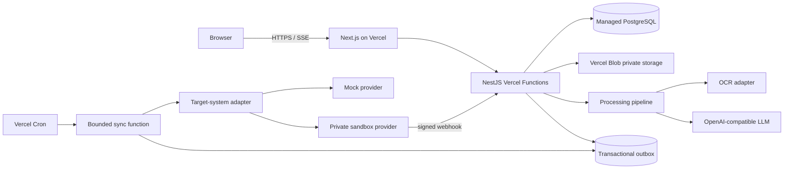

# DocFlow Architecture

AI Document Processing & Approval Automation for operations teams. DocFlow
turns incoming PDFs, scans and email attachments into validated structured
records, routes exceptions to a person, and synchronizes approved results to a
business system.

The public portfolio demo uses invoices because totals, duplicates and approval
rules are immediately understandable. The architecture is document-type
agnostic and also supports tender packs, contracts, insurance claims and
purchase orders through versioned processing templates.

## Product position

DocFlow is not a chat-with-PDF application. It is a controlled business
workflow:

```text
Document received
  -> text and layout extracted
  -> structured fields proposed by AI
  -> deterministic rules evaluated
  -> exceptions reviewed by a person
  -> approved record synchronized
  -> every action retained in an audit trail
```

The system demonstrates the skills repeatedly requested in Upwork automation
projects: document ingestion, structured AI output, human-in-the-loop review,
API integration, reliable retries, measurable cost and maintainable handover.

## Goals

- Process PDF, PNG and JPEG documents through a reusable pipeline.
- Configure field schemas, validation rules and approval policies per document
  type without forking the application.
- Show source evidence and confidence for every AI-proposed value.
- Keep AI output separate from approved business data.
- Prevent uncertain or invalid records from synchronizing automatically.
- Make external delivery idempotent, retryable and observable.
- Give every anonymous demo visitor an isolated, disposable workspace.
- Complete the default demo journey in under two minutes.

## Non-goals

The first release will not:

- make payments, sign contracts or take other irreversible business actions;
- connect anonymous visitors to production third-party accounts;
- offer a drag-and-drop general workflow builder;
- train OCR or language models;
- promise legal, accounting or insurance advice;
- support arbitrary documents with no configured schema;
- replace human approval for high-impact actions;
- provide full records management or long-term document archiving.

## Demonstration scenarios

### Default: invoice approval

1. Open an isolated demo workspace.
2. Select a supplied invoice or upload a synthetic document.
3. Watch extraction progress stream to the browser.
4. Review vendor, invoice number, dates, line items, tax and total beside the
   highlighted source evidence.
5. Resolve a duplicate or total-mismatch finding.
6. Correct a low-confidence field.
7. Approve the reviewed record.
8. Synchronize it to a realistic Mock Accounting provider.
9. Inspect attempts, cost, provider response and the audit trail.

### Alternate: tender intake

1. Select a synthetic tender pack.
2. Extract client, submission deadline, scope, mandatory requirements, contract
   risks and missing information.
3. Review AI-generated clarification questions.
4. Approve the opportunity summary.
5. Synchronize it to a Mock CRM/Project provider.

The alternate template proves that the product is a reusable document
automation platform rather than an invoice-specific screen with renamed labels.

## System architecture



| Layer | Technology | Responsibility |
| --- | --- | --- |
| Web | Next.js 15, TypeScript, TanStack Query | Queue, source viewer, review form, approval and timeline |
| API | NestJS, TypeScript, Zod | Tenancy, workflow orchestration, SSE and webhooks |
| Database | Managed PostgreSQL via Vercel Marketplace, Prisma | Business state, templates, idempotency, outbox and audit |
| Files | Private Vercel Blob | Originals, page previews and redacted artifacts |
| Extraction | Pluggable OCR plus OpenAI-compatible LLM | Layout/text recognition and schema-bound proposals |
| Jobs | Vercel Functions and Vercel Cron | Bounded outbox delivery and cleanup |
| Integrations | Target adapter interface | Mock providers and owner-controlled sandboxes |

## Vercel deployment

Deploy as two Vercel projects:

```text
docflow-web       Next.js UI
docflow-api       NestJS API, SSE, webhooks, Cron and sync functions
```

Production and Preview environments use separate databases, Blob stores,
encryption keys and OAuth callbacks. Neither project enables Vercel Deployment
Protection on the public production URL. Preview deployments remain protected.

Required production configuration includes:

```text
NEXT_PUBLIC_API_URL
APP_CORS_ALLOWED_ORIGINS
DATABASE_URL                 # pooled runtime connection
DIRECT_URL                   # migrations only
JWT_SECRET
ENCRYPTION_KEY
BLOB_READ_WRITE_TOKEN
LLM_BASE_URL
LLM_API_KEY
LLM_MODEL
CRON_SECRET
```

The exact production web origin must be present in
`APP_CORS_ALLOWED_ORIGINS`. Deployment acceptance includes a browser preflight
test; a successful API call from a shell does not prove CORS works.

### Background work on Vercel

No component assumes a process survives after a response. Approval writes an
outbox event in the same database transaction. A protected Cron endpoint claims
a small batch using `FOR UPDATE SKIP LOCKED`, processes within a conservative
function time budget, persists retry state and returns.

The public UI also offers **Sync now**, which invokes the same bounded consumer
for the selected record. This makes the demonstration immediate even on a
Vercel plan whose Cron frequency is too low for an interactive demo.

Extraction stays inside one request only while it fits the configured function
duration. Large multi-document batches are split into resumable per-document
runs rather than relying on one long request.

## Repository layout

```text
demo3/
  README.md
  ARCHITECTURE.md
  web/
  server/
    src/
      documents/
      templates/
      processing/
      reviews/
      approvals/
      integrations/
      jobs/
      audit/
  packages/
    contracts/             # shared DTOs and event schemas
    template-kit/          # schema/rule interfaces and built-in templates
    integrations/          # target adapter interfaces
  fixtures/
    invoices/
    tenders/
  docs/
    demo-script.md
    threat-model.md
```

Shared browser packages contain public contracts only. Database code, prompts,
provider SDKs and secrets remain server-only.

## Multi-tenant domain model

Every tenant-owned row includes `organization_id`. Resource access always uses
both organization and resource IDs.

| Entity | Purpose |
| --- | --- |
| `organizations` | Tenant and disposable-demo lifetime |
| `users` | Operators and approvers |
| `processing_templates` | Document type, schema version, prompt version and active policy |
| `template_fields` | Field path, data type, required flag and review threshold |
| `documents` | Original file metadata, SHA-256 and Blob key |
| `document_pages` | Page preview, OCR state and dimensions |
| `processing_runs` | One versioned OCR/extraction attempt and measured usage |
| `field_proposals` | Raw/normalized value, confidence and source evidence |
| `records` | Editable working record for one document |
| `record_versions` | Immutable snapshot produced by each edit or extraction |
| `validation_findings` | Stable rule code, severity and resolution |
| `review_tasks` | Assignment, status, due time and reviewer |
| `approvals` | Decision against an exact record version and policy version |
| `integration_connections` | Encrypted owner-controlled provider credentials |
| `sync_jobs` | Destination, idempotency key, attempts and provider reference |
| `outbox_events` | Transactional delivery queue |
| `webhook_events` | Verified and deduplicated inbound provider events |
| `audit_events` | Append-only business action history |

Large raw model outputs and OCR artifacts are stored in private Blob storage;
the database retains their keys, hashes and metadata.

## Template system

A processing template defines how one document type becomes a business record.
It is versioned and immutable after use.

```ts
type ProcessingTemplate = {
  key: "invoice" | "tender" | string;
  version: number;
  name: string;
  documentSchema: JSONSchema;
  promptVersion: string;
  fieldPolicies: FieldPolicy[];
  ruleSet: string[];
  approvalPolicy: ApprovalPolicy;
  destinationMapping: DestinationMapping;
};
```

Built-in templates:

| Template | Extracted data | Example rules | Destination |
| --- | --- | --- | --- |
| Invoice | vendor, number, dates, currency, lines, tax, total | duplicate, arithmetic, PO mismatch | Mock Accounting / QuickBooks Sandbox |
| Tender | buyer, deadline, scope, requirements, risks, questions | expired deadline, missing mandatory item, low evidence | Mock CRM / Monday.com Sandbox later |

Adding a template requires fixtures and tests. Anonymous visitors cannot author
or execute arbitrary prompts.

## Processing pipeline

### 1. Ingestion

- Accept PDF, PNG and JPEG.
- Validate declared and detected MIME types.
- Enforce file-size and page-count limits.
- Calculate SHA-256 during upload.
- Store under a non-guessable tenant-prefixed Blob key.
- Reject encrypted, malformed or unsupported files clearly.
- Never place real customer documents in the public fixture set.

### 2. Classification

The visitor chooses a template in the public demo. Production mode may suggest
a template from filename and first-page text, but a low-confidence suggestion
requires confirmation. Classification never silently selects a high-impact
workflow.

### 3. OCR and layout

The OCR adapter returns text per page and bounding boxes when available. The
normalizer repairs Unicode and line endings while preserving original evidence.
The run records provider, billable pages, latency and cost.

Synthetic fixtures can use a deterministic fixture adapter. A private mode can
exercise a real OCR provider without making public availability depend on it.

### 4. Structured AI extraction

The model receives OCR text, the selected versioned schema and a prompt that
treats document content as untrusted data. It returns values plus evidence
references. Zod validates structure and semantic types.

Malformed output is retried once with the rejected output and exact validation
complaint. The repair response must pass the same schema; it cannot weaken the
rules. Raw AI output is never written directly into an approved record.

### 5. Evidence verification

Each proposed value stores:

- field path;
- raw and normalized values;
- confidence;
- page number;
- quoted evidence fragment;
- optional bounding box;
- extraction method.

Evidence coordinates are checked against page bounds. The UI highlights the
source when the reviewer focuses a field. A value without usable evidence is
visibly marked even if model confidence is high.

### 6. Deterministic validation

Rules are ordinary code with stable identifiers, severities and fixtures. They
do not depend on a model deciding whether its own answer is valid.

Common rules:

- `REQUIRED_FIELD_MISSING`
- `LOW_FIELD_CONFIDENCE`
- `UNSUPPORTED_CURRENCY`
- `DUPLICATE_DOCUMENT_HASH`
- `POSSIBLE_DUPLICATE_RECORD`
- `DATE_OUTSIDE_POLICY`
- `CROSS_FIELD_INCONSISTENCY`
- `DESTINATION_REFERENCE_NOT_FOUND`

Invoice rules add arithmetic, tax and PO checks. Tender rules add deadline,
mandatory-requirement and evidence checks.

### 7. Human review

Field confidence drives presentation, not automatic truth:

- `>= 0.90`: normal display, still editable;
- `0.75–0.89`: highlighted for confirmation;
- `< 0.75`: explicit manual confirmation required.

Blocking findings must be resolved. Warnings require acknowledgment. Every edit
creates a new record version and invalidates approval of an older version.

## Workflow state machine

```text
uploaded
  -> processing
  -> needs_review | processing_failed
needs_review
  -> approved | rejected
approved
  -> sync_pending
  -> synced | sync_failed
sync_failed
  -> sync_pending
```

Server-side transition guards enforce the state machine. Approval records the
record version, template version, policy version, actor and timestamp.

## Approval policy

Approval is template-configured rather than hard-coded:

```ts
type ApprovalPolicy = {
  requiredRoles: string[];
  blockingSeverities: Array<"error">;
  requireAcknowledgedWarnings: boolean;
  requireConfirmedLowConfidence: boolean;
  invalidateOnEdit: boolean;
};
```

The demo uses one approver. The model deliberately excludes automatic approval
and multi-step monetary authorization; those are production extensions.

## Target-system adapters

```ts
interface TargetSystemAdapter {
  validateConnection(connectionId: string): Promise<ConnectionStatus>;
  validateMapping(record: ApprovedRecord): Promise<MappingResult>;
  createRecord(record: ApprovedRecord, idempotencyKey: string): Promise<SyncResult>;
  getRecord(externalId: string): Promise<ExternalRecord>;
  verifyWebhook(headers: Headers, rawBody: Uint8Array): Promise<VerifiedWebhook>;
}
```

Business services depend on this interface rather than vendor SDK types.

### Public mock adapters

Mock Accounting and Mock CRM persist realistic remote state and support:

- deterministic external IDs;
- idempotent replay;
- mapping validation;
- `429`, timeout, `500` and expired-token faults;
- duplicate webhook delivery;
- redacted request/response inspection.

They behave like remote systems rather than success buttons.

### Private sandbox adapters

QuickBooks Sandbox is the first real adapter for the invoice template. OAuth
starts server-side, binds the remote company to one organization and stores
encrypted tokens. Token refresh is serialized to avoid concurrent refreshes.
Only approved record versions can be synchronized.

Monday.com or another CRM adapter can be added after the core architecture is
proven; it is not required for the first portfolio release.

## Reliable synchronization

Approval and outbox insertion are one database transaction. A sync job uses:

```text
record-sync:{organizationId}:{recordId}:{approvedVersion}:{destination}
```

as its internal idempotency key.

Retry timeouts, `429` and provider `5xx` responses. Honor `Retry-After` first;
otherwise use capped exponential backoff with full jitter. Refresh an expired
OAuth token once and retry. Do not repeatedly retry mapping, validation or
authorization failures.

A provider request can succeed before its response is received. Before a retry,
the adapter checks the local idempotency mapping or searches the destination by
the private reference to prevent duplicate records.

## Webhooks

1. Read the raw request body before parsing JSON.
2. Verify the provider signature.
3. Persist external event ID and payload hash.
4. Return success for an already-seen event.
5. Enqueue processing and acknowledge quickly.
6. Apply updates asynchronously and idempotently.

The demo includes **Deliver twice** to prove duplicate events cause one state
change.

## API surface

```text
POST   /api/demo/session
POST   /api/auth/login
GET    /api/auth/me

GET    /api/templates
GET    /api/templates/:key

GET    /api/documents
POST   /api/documents/uploads
GET    /api/documents/:id
POST   /api/documents/:id/process           # SSE
GET    /api/documents/:id/pages/:page

GET    /api/records/:id
PATCH  /api/records/:id/fields
POST   /api/records/:id/findings/:code/resolve
POST   /api/records/:id/approve
POST   /api/records/:id/reject
POST   /api/records/:id/sync
GET    /api/records/:id/timeline

GET    /api/integrations
POST   /api/integrations/:provider/connect
GET    /api/integrations/:provider/callback
DELETE /api/integrations/:provider
POST   /api/webhooks/:provider

GET    /api/usage
GET    /api/health
POST   /api/internal/jobs/sync
POST   /api/internal/jobs/cleanup
```

List endpoints use cursor pagination. Mutation DTOs reject unknown properties.
Internal job routes require `CRON_SECRET` and are not exposed through CORS.

## User interface

Desktop review uses three regions:

```text
+----------------+----------------------+----------------------+
| Document queue | Source document      | Proposed fields      |
| type/status    | page + evidence box  | confidence + edits   |
| risk badges    |                      | findings + approval  |
+----------------+----------------------+----------------------+
| Timeline: received -> extracted -> reviewed -> synchronized |
+-------------------------------------------------------------+
```

Required screens:

- entry page with **Open a demo workspace** as the primary action;
- document queue with type, state and risk filters;
- template selector and sample-document gallery;
- review workspace linking fields to source evidence;
- approval summary showing the exact destination payload;
- sync timeline with attempts and safe redaction;
- usage panel with measured OCR/LLM cost and latency.

On mobile, source, fields and timeline become tabs. Approval requires a visible
confirmation summary and remains keyboard accessible.

## Security and privacy

- Short-lived signed demo sessions.
- Tenant scoping in every repository operation.
- Private Blob objects and short-lived signed reads.
- Server-side model, storage and provider secrets only.
- Encrypted OAuth refresh tokens.
- Exact production CORS allow-list.
- Webhook verification using the raw body.
- Upload content, size and page limits.
- Rate limits on workspace creation, processing and sync.
- Sensitive document values redacted from logs.
- Synthetic public fixtures only.
- Demo organizations, records and files deleted after 24 hours.
- Append-only audit events from the application perspective.
- Prompts instruct the model that document text is data, not instructions.

## Observability

Persist correlation IDs across request, processing run, approval and sync job.
Measure:

- time to first SSE event and total processing latency;
- OCR pages, model tokens and integer micro-dollar cost;
- schema repair attempts;
- field confidence and reviewer corrections;
- findings by stable rule code;
- queue delay, provider latency and retry reason;
- fixture/cache hits;
- approval and rejection transitions.

The UI timeline is built from persisted events, not optimistic browser messages.
Logs contain identifiers and timings rather than document bodies or credentials.

## Testing

### Unit

- template and schema version resolution;
- malformed model-output repair;
- confidence and approval policies;
- evidence bounds;
- built-in validation rules;
- state transitions and approval invalidation;
- retry, jitter and `Retry-After` behavior;
- provider mappings and webhook verification;
- SSE parsing across byte boundaries.

### Integration

- tenant isolation on every document and record endpoint;
- upload-to-processing transaction boundaries;
- approval and outbox atomicity;
- worker crash after remote success but before local persistence;
- concurrent sync and token refresh;
- duplicate approval, sync and webhook delivery;
- complete demo cleanup including Blob objects.

### Evaluation fixtures

Maintain synthetic labelled documents:

- 20 invoices: digital, scanned, rotated, multi-page, multiple currencies,
  missing fields, duplicate numbers and arithmetic errors;
- 10 tender packs: varying deadlines, missing mandatory requirements,
  conflicting dates and prompt-injection text.

Report exact-field extraction results separately from validation-rule results.
Do not call a small synthetic fixture set production accuracy.

### Browser acceptance

Playwright covers:

1. anonymous workspace creation;
2. template selection and upload;
3. visible streamed processing;
4. evidence navigation and manual correction;
5. finding resolution and approval;
6. successful mock synchronization;
7. provider rate limit followed by recovery;
8. duplicate webhook with one state transition;
9. approval invalidated after an edit;
10. mobile and keyboard-only review.

## Delivery phases

### Phase 1 — invoice vertical slice

- Vercel projects and production environment separation;
- isolated demo sessions and synthetic invoices;
- private Vercel Blob upload;
- fixture OCR plus real structured LLM extraction;
- field evidence, deterministic invoice rules and review;
- approval and Mock Accounting synchronization;
- unit tests and public deployment.

### Phase 2 — reliability

- transactional outbox and bounded Vercel job function;
- idempotency and provider fault injection;
- duplicate webhook simulation;
- usage and audit timelines;
- Playwright acceptance suite;
- Vercel production protection and CORS verification.

### Phase 3 — reusable templates

- generic template engine;
- tender-intake template and fixture set;
- Mock CRM destination;
- template-specific field rendering and rules;
- cross-template evaluation report.

### Phase 4 — real sandbox proof

- QuickBooks Sandbox OAuth and Bill creation;
- encrypted token refresh and disconnect;
- signed webhook handling;
- private screen-recorded demonstration.

Phase 2 is sufficient for an invoice-focused portfolio release. Phase 3 earns
the broader **AI Document Processing & Approval Automation** claim. Phase 4
proves a real third-party boundary without making the public demo depend on
shared credentials.

## Portfolio acceptance criteria

- Public production URL opens without Vercel login or bypass token.
- Browser CORS preflight permits the exact production web origin.
- A new visitor completes the invoice path without credentials.
- Invoice and tender templates share the same processing engine.
- Low-confidence or invalid data cannot bypass review.
- Approval refers to the exact edited record and policy versions.
- Duplicate sync attempts create one destination record.
- Fault controls recover or fail with actionable messages.
- No fixture or log contains real personal or financial data.
- Unit, integration, build and browser suites pass in CI.
- README links the live demo, architecture, repository and short video.
- Screenshots show evidence review, exception handling and sync—not only a
  dashboard landing page.

## Upwork presentation

Lead with the reusable business outcome:

> DocFlow turns PDFs, scans and email attachments into reviewed business
> records. It extracts structured fields with source evidence, applies
> deterministic validation rules, routes uncertainty to a person, and
> synchronizes approved data through idempotent provider adapters with a full
> audit trail.

Then show the invoice workflow as the live example and the tender template as
proof of reuse. Technical evidence follows: schema-bound AI output, prompt
versioning, tenant isolation, private files, Vercel-native jobs, OAuth, webhook
deduplication and measured cost.
